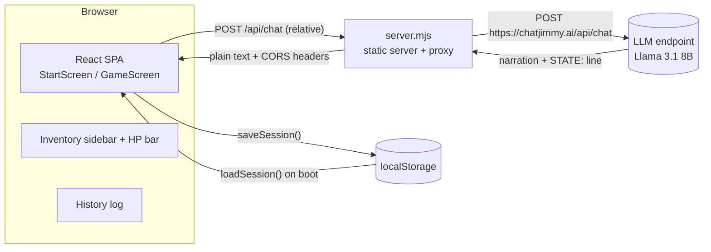
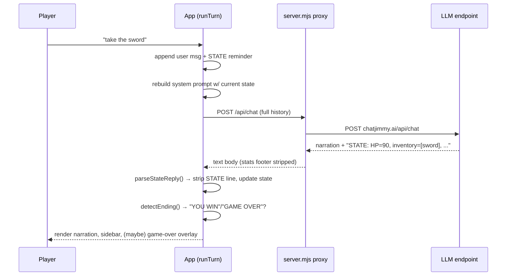

# VOYAGE — AI Dungeon Master

An interactive **text-adventure game** where an LLM is the dungeon master.
You type free-text actions ("look around", "take the sword", "go north") and
the AI narrates the world, tracks your health, inventory, location and story
flags, and advances a living story. **Every playthrough is different.**

Built with **TypeScript + React + Vite** as a single-page web app.

> **Live demo:** run locally with `npm run serve` → http://localhost:4173


---

## Table of contents

- [Features](#features)
- [Tech stack](#tech-stack)
- [Architecture](#architecture)
- [How the DM loop works](#how-the-dm-loop-works)
- [State tracking (the core trick)](#state-tracking-the-core-trick)
- [The CORS / streaming problem & solution](#the-cors--streaming-problem--solution)
- [Project structure](#project-structure)
- [Demo mode (video walkthroughs)](#demo-mode-video-walkthroughs)
- [Getting started](#getting-started)
- [Running & scripts](#running--scripts)
- [The DM system prompt](#the-dm-system-prompt)
- [Testing & verification](#testing--verification)
- [Fork & contribute](#fork--contribute)
- [New feature ideas](#new-feature-ideas)
- [License](#license)

---

## Features

- **Genre picker** — fantasy, sci-fi, horror, pirate, western — each with its
  own accent color and a distinct **win condition**.
- **Difficulty** — easy / normal / hard (HP loss, clue frequency, harshness).
- **Persistent game state** — HP, inventory, location and flags tracked by the
  DM on every turn and parsed into a live sidebar.
- **Inventory sidebar** with an **animated HP bar** and current location.
- **DM narration as styled prose**; player actions as small italic chips.
- **Typing indicator** while the DM "thinks".
- **💡 Hint button** — asks the DM for a 1-sentence nudge without spoiling.
- **↺ Restart** — start a fresh adventure anytime.
- **Game Over / You Win overlay** with run stats (turns, items, HP).
- **localStorage persistence** — refresh mid-game and it resumes.
- **Mobile-friendly** — input bar pinned to the bottom, history scrolls.
- **Live endpoint** — every reply is generated on the fly; nothing hardcoded.

---

## Tech stack

| Layer        | Technology |
| ------------ | ---------- |
| Language     | [TypeScript](https://www.typescriptlang.org/) (strict) |
| UI           | [React 18](https://react.dev/) + JSX |
| Build tool   | [Vite 5](https://vitejs.dev/) |
| Styling      | Hand-written CSS (CSS variables for theming) |
| LLM endpoint | `chatjimmy.ai/api/chat` (Llama 3.1 8B) |
| Persistence  | `localStorage` |
| Dev server   | Vite dev server with `/api/chat` proxy |
| Prod server  | Small Node server (`server.mjs`) that serves `dist/` + proxies the API |
| Testing      | Node integration test + Playwright headless-browser smoke test |

No heavy runtime dependencies: the app only pulls in `react` and
`react-dom`. The proxy server uses only Node's built-in `http`/`https`.

---

## Architecture



And the data flow inside one DM turn:



---

## How the DM loop works

Every turn follows the same shape, orchestrated in
[`src/App.tsx`](src/App.tsx) (`runTurn`):

1. Take a **snapshot** of the current messages + state.
2. **Rebuild the system prompt** with the latest `STATE:` block (this is
   "option A" — the in-prompt state block).
3. Append the player's action as a user message (plus a small reminder so the
   model never forgets the state line).
4. Call the endpoint with the full history.
5. **Parse** the machine-readable `STATE:` line out of the reply.
6. **Detect** win/lose endings.
7. Persist to `localStorage`.

```ts
// src/App.tsx — the core turn
const raw = await callDM(working);
const parsed = parseStateReply(raw, workingState);
const narrative = parsed ? parsed.narrative : raw; // strip STATE line
const nextState = parsed ? parsed.state : workingState; // graceful fallback
const ending = detectEnding(narrative);
```

The model replies with something like:

```
The blacksmith hands you a worn iron sword. "It'll serve you better than
that stick," he grunts. The forge glow dances across the room. What do you do?

STATE: HP=90, inventory=[iron sword], location=blacksmith's forge, flags={door_open:false}
```

---

## State tracking (the core trick)

The whole game hinges on the DM emitting a **machine-readable state line**
alongside its prose. We make this reliable two ways:

1. **The system prompt** demands the `STATE:` line and places the current
   state right where the model will read it.
2. **A per-turn reminder** is appended to every player message
   (`STATE_REMINDER`), which dramatically improved reliability on the small
   8B model.

The regex in [`src/lib/dm.ts`](src/lib/dm.ts) extracts it:

```ts
const STATE_RE =
  /STATE:\s*HP=(\d+),\s*inventory=\[([^\]]*)\],\s*location=(.*?),\s*flags=\{(.*?)\}/i;

export function parseStateReply(reply, fallback) {
  const match = reply.match(STATE_RE);
  if (!match) return null; // model omitted it → keep previous state
  // ... clamp HP, split inventory, parse location + flags ...
  const narrative = reply.replace(STATE_RE, "").trim(); // strip before render
  return { state, narrative };
}
```

If the model omits the line (small models do), we **keep the previous state**
and still render the narration — the game never breaks.

---

## The CORS / streaming problem & solution

`chatjimmy.ai/api/chat` sends **no CORS headers** and responds as
`text/event-stream`, so a browser SPA cannot call it directly. We solve this
with a tiny Node proxy ([`server.mjs`](server.mjs)) that:

1. **serves the built SPA** from `dist/`, and
2. **proxies** `POST /api/chat` → `https://chatjimmy.ai/api/chat`, adding CORS
   headers and returning the plain-text body.

The app calls the **relative** `/api/chat`, so it works both behind the
production server and behind the Vite dev proxy (`vite.config.ts`):

```ts
// vite.config.ts — dev proxy
server: {
  proxy: {
    "/api/chat": { target: "https://chatjimmy.ai", changeOrigin: true },
  },
},
```

The `<|stats|>…<|/stats|>` footer the endpoint appends is stripped
client-side:

```ts
export function stripStatsFooter(text: string): string {
  return text.replace(/<\|stats\|>[\s\S]*?<\|[^>]*stats\|>/g, "").trim();
}
```

---

## Project structure

```
build-1/
├── index.html              # SPA entry
├── package.json
├── tsconfig.json
├── vite.config.ts          # dev proxy for /api/chat
├── server.mjs              # prod server: serves dist/ + proxies /api/chat
├── README.md
├── .gitignore
├── scripts/
│   ├── dmtest.ts           # DM engine integration test (live endpoint)
│   ├── smoke.mjs           # Playwright headless-browser smoke test
│   └── demo_smoke.mjs      # Playwright demo-mode walkthrough test
└── src/
    ├── main.tsx            # React root
    ├── App.tsx             # game state + DM loop orchestration
    ├── styles.css          # dark, genre-flavored theme
    ├── types.ts            # shared TypeScript types
    ├── lib/
    │   ├── dm.ts           # prompt builder, parser, endpoint call
    │   ├── demo.ts         # scripted demo-mode DM (for video walkthroughs)
    │   └── storage.ts      # localStorage persistence
    └── components/
        ├── StartScreen.tsx
        ├── GameScreen.tsx
        ├── HistoryLog.tsx
        ├── InventorySidebar.tsx
        ├── GameOverScreen.tsx
        └── Footer.tsx      # "Built by Harish Kotra" credits
```

---

## Demo mode (video walkthroughs)

For recording a reliable, fast walkthrough, flip on **Demo mode** — a fully
scripted, deterministic DM that responds instantly with no network calls. It
still flows through the exact same parsing pipeline as the live endpoint, so
the video shows the real UI behavior (inventory updates, animated HP bar,
Game Over / You Win overlays).

Enable it two ways:

- **Start screen:** tick the "Demo mode" checkbox, then Begin.
- **URL:** open the app with `?demo=1` to auto-enable it.

The scripted story is keyword-driven (`src/lib/demo.ts`), so the presenter can
type natural actions:

| You type | What happens |
| --- | --- |
| `look around` | Describes the room |
| `take the sword` | Adds "rusty sword" to inventory |
| `attack the goblin` | HP drops, monster defeated (without a sword, you take more damage) |
| `search the chest` | **YOU WIN** (once the monster is defeated) |
| `give up` / `die` | **GAME OVER** |
| `drink a potion` | Heals +30 HP |

A yellow **DEMO** badge appears in the header while demo mode is active, so
viewers know the narration is scripted. The demo flow is covered by
`scripts/demo_smoke.mjs`.

## Getting started

```bash
git clone <your-fork-url>
cd build-1
npm install
npm run dev        # Vite dev server → http://localhost:5173 (with proxy)
```

Or run the production build:

```bash
npm run build
npm run serve      # serves dist/ + proxy → http://localhost:4173
```

---

## Running & scripts

| Script            | Description                                        |
| ----------------- | -------------------------------------------------- |
| `npm run dev`     | Vite dev server on :5173 (proxies `/api/chat`)     |
| `npm run build`   | Type-check + production build to `dist/`           |
| `npm run preview` | Vite preview of the build                          |
| `npm run serve`   | Node server: serves `dist/` + proxies `/api/chat`  |

---

## The DM system prompt

The prompt is assembled in `buildSystemPrompt()` and injected fresh on every
turn with the current state. Genre, difficulty and the win condition are
always present:

```ts
export function buildSystemPrompt(config, state) {
  return [
    `GENRE: ${config.genre}. DIFFICULTY: ${config.difficulty} (${diff.note}).`,
    `WIN CONDITION: ${genre.win}.`,
    BASE_SYSTEM,
    "",
    "CURRENT STATE:",
    formatState(state),
  ].join("\n");
}
```

---

## Testing & verification

- **`scripts/dmtest.ts`** — runs the real DM engine against the live endpoint:
  verifies state parsing, inventory/HP updates, ending detection, history
  trimming and stats-footer stripping.
- **`scripts/smoke.mjs`** — drives the actual UI in a headless browser:
  start → live narration → player action → sidebar updates → **resume after
  reload** → hint → restart, asserting **zero console errors**.

Both were used to confirm every reply comes live from the endpoint — no
hardcoded text.

---

## Fork & contribute

We'd love contributions! Here's how to get started:

1. **Fork** this repo and clone your fork.
2. Create a branch: `git checkout -b feat/my-feature`.
3. Make your change (see [New feature ideas](#new-feature-ideas) below).
4. Run the checks:
   ```bash
   npm run build
   node scripts/dmtest.ts     # DM engine still works live
   node scripts/smoke.mjs     # UI still works end-to-end
   ```
5. Commit with a clear message, push, and open a pull request.

### Guidelines

- Keep the DM engine in `src/lib/dm.ts` — prompt and parser changes live
  there.
- Add types to `src/types.ts` first; everything else flows from them.
- Don't hardcode narration; everything must come from the live endpoint.
- Preserve the graceful fallback when the model omits the `STATE:` line.
- Match the existing dark, genre-flavored visual language.

---

## New feature ideas

Here are concrete, well-scoped features to pick up:

- **Multiple LLM models** — let players choose the model behind the DM, and
  surface latency/token stats.
- **True streaming** — the endpoint is `text/event-stream`; render tokens as
  they arrive for a real typewriter effect.
- **Saved games** — persist multiple named save slots instead of one.
- **Achievements & stats** — track runs, wins, deaths, items found across
  sessions.
- **Custom genres & win conditions** — let players define their own.
- **Player backstory** — let the player write a character bio the DM folds in.
- **World map** — parse `location` into a simple node graph and render it.
- **Audio / ambience** — genre-appropriate ambient sound and sound effects.
- **Accessibility** — full keyboard navigation, larger text mode, screen-reader
  support for the narration.
- **Rate limiting & retry** — exponential backoff when the endpoint is flaky.
- **PWA** — make it installable and offline-capable.
